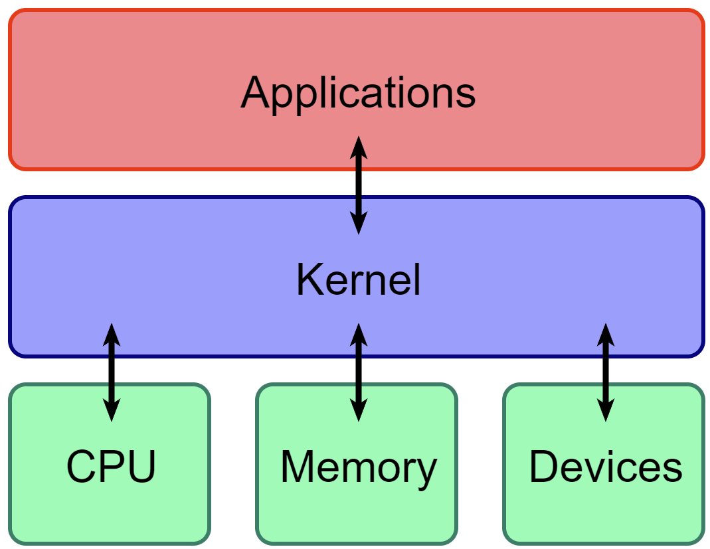

# The Kernel

The kernel is a piece of software at the core of an operating system that generally has unrestricted access to hardware.

A majority of the tasks that the kernel does is related to main memory.

There is **4** major areas that the Kernel manages:

* **Processes**: Determines which processes are allowed to use the CPU
* **Memory**: Keep track of all memory, which process has access to what region of memory, what might be shared, and all free memory
* **Device Drivers**: Interface between hardware and a process
* **System Calls and Support**: Processes use system calls to communicate with the kernel