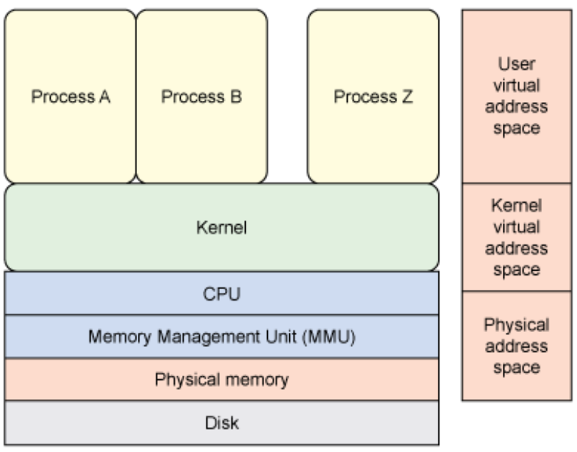

# Memory Management

Memory Management is one of the core tasks of the kernel, and there is a lot of conditions that the Kernel must uphold, including:

* The kernel must have its own private area in memory that user processes can’t access.
* Each user process needs its own section of memory.
* One user process may not access the private memory of another process.
* User processes can share memory.
* Some memory in user processes can be read-only.
* The system can use more memory than is physically present by using disk space as auxiliary.

## Virtual Address Space

In Linux, user memory and kernel memory exist in separate address spaces, which are virtualized. This adds a layer of abstraction so that address space 0 to a user program is not physical space 0.

### Page Tables
To map a virtual address to a physical address, we consult a **Page Table**

---

Putting this all together, the memory hierarchy looks like:

