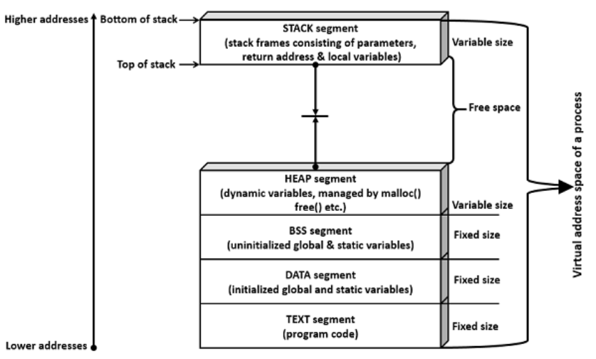
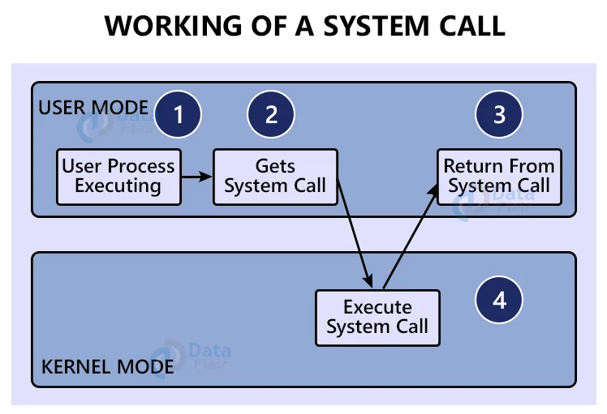

# Syscalls
System Calls (or syscalls for short) are routines that an user process can call do an action that the process does not have access to do directly.

> The system call is the fundamental interface between an application and the Linux kernel.

2 Examples of common syscalls are

* **fork()** creates a new process by duplicating the calling process. The new process is referred to as the child process. The calling process is referred to as the parent process.
* **exec()** replaces the current process image with a new process image[1].

[1] A process image is an executable file required while executing the program. Usually contains at least a Code segment, text segment, data segment, stack segment, & heap segment.

The important thing here is that syscalls allows a way for user processes to execute privileged code.

---

Syscalls need a lot of care, and you don't want any program to be a syscall, as they access kernel mode, you don't want potentially buggy software with that privilege.

https://nvd.nist.gov/vuln/detail/CVE-2021-4154 is an example of an exploit from a syscall

> A use-after-free flaw was found in cgroup1_parse_param in kernel/cgroup/cgroup-v1.c in the Linux kernel's cgroup v1 parser. A local attacker with a user privilege could cause a privilege escalation by exploiting the fsconfig syscall parameter leading to a container breakout and a denial of service on the system.