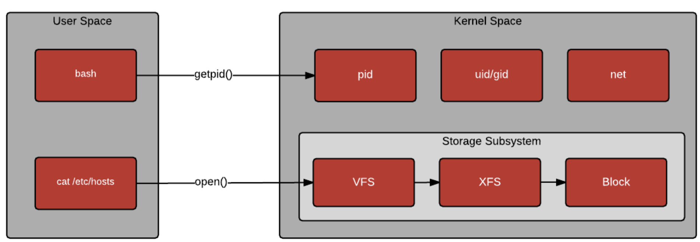

# User Space

The term user space (or userland) refers to all code that runs outside the operating system's kernel.



Most user processes run in its own virtual memory space, and can't access the memory of other processes unless explicitly requested.

The only way to access the hardware from userspace is through syscalls such as the following command to view your memory

```bash
$ free -h
```