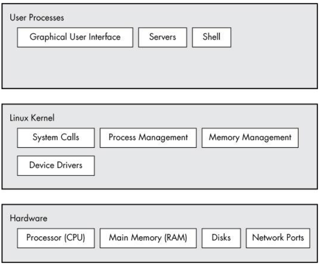

# Linux System Organization

Linux generally has 3 major areas (from top to bottom):

* User Mode
* Kernel Mode
* Hardware

### User Mode
Restricted access to a subset of memory and safe CPU operations. If a mistake happens, the consequences can be limited.

### Kernel Mode
Software that resides in memory that tells the CPU what to do. This layer manages the hardware and primarily atcs as an intercace between the hardware and running programs.

### Hardware
This is the physical hardware on the device (motherboard, flash drives, RAM, GPU, CPU, ect...)