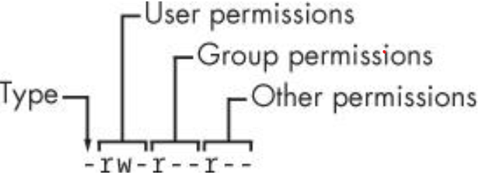

# File Permissions

```bash
$ mkdir -p tmp && cd tmp
$ echo "echo 'hello world!'" > test.sh
$ ls -l
total 0
-rw-rw-r-- 1 mitch mitch 20 Mar 13 20:53 test.sh
```



File permission meanings:
| Permission | Meaning
| --- | --- |
| r | file is readable |
| w | file is writeable |
| x | file is executable |
| - | means nothing |


If we try to execute the shell script we will see the following:
```bash
$ ./test.sh
bash: ./test.sh: Permission denied
```
This is because we need to add the executable type to this file.

```bash
$ chmod +x test.sh
$ ls -l test.sh
-rwxrwxr-x 1 mitch mitch 20 Mar 13 20:53 test.sh
$ ./test.sh
hello world!
```

We can also change who owns a file with chown.

```bash
$ sudo chown root:root test.sh
$ ls -l test.sh
-rwxrwxr-x 1 root root 20 Mar 13 20:53 test.sh
```

