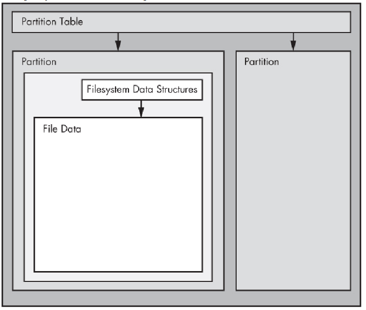

# Filesystem and Partitions

Working with disk devices is an important part of Linux. This section is how you will reformat a hard drive or flashdrive, and even change the filesystem if you need to.

A typical Linux disk looks like:



Partitions are part of the disk, each partition has it's own device file such as `/dev/sda1` `/dev/sda2` `/dev/sda3` which all reside on `/dev/sda`.

---

### GPT 
Globally Unique Identifier Partition Table is a standard for the layout of partition tables of a physical computer storage device

---

You can view your system's partition table with
```bash
$ sudo parted -l
Model: QEMU QEMU HARDDISK (scsi)
Disk /dev/sda: 1611GB
Sector size (logical/physical): 512B/512B
Partition Table: gpt
Disk Flags:

Number  Start   End     Size    File system  Name  Flags
 1      1049kB  2097kB  1049kB                     bios_grub
 2      2097kB  2150MB  2147MB  ext4
 3      2150MB  1611GB  1608GB
```

I can see the first device is `/dev/sda` with a GPT partition table.

---

A very popular tool to list all block devices is `lsblk`

```bash
$ lsblk
...
NAME                      MAJ:MIN RM   SIZE RO TYPE MOUNTPOINTS
sda                         8:0    0   1.5T  0 disk
├─sda1                      8:1    0     1M  0 part
├─sda2                      8:2    0     2G  0 part /boot
└─sda3                      8:3    0   1.5T  0 part
  └─ubuntu--vg-ubuntu--lv 253:0    0   1.5T  0 lvm  /
sr0                        11:0    1   1.5G  0 rom
```


Making a block device and playing around

```bash
$ dd if=/dev/zero of=~/diskimage bs=1M count=5
$ mkfs.ext4 ~/diskimage
$ sudo losetup /dev/loop40 ~/diskimage
$ mkdir -p ~/mymountpoint/
$ sudo mount /dev/loop40 mymountpoint/
$ lsblk | grep loop40
loop40                      7:40   0     5M  0 loop /home/mitch/mymountpoint
```

In the above commands, we created a 5MB block device and mounted it. We can now unmount the block device with

```bash
$ sudo umount ~/mymountpoint
# same as
$ sudo umount /dev/loop40
```

We can now add a partition to this loop device
```bash
$ sudo fdisk /dev/loop40
# press [n] and then [enter] until you created a new partion
# press [w] to write the partition to disk
```

```bash
$ sudo losetup -P /dev/loop40
$ lsblk | grep "loop40"
loop40                      7:40   0     5M  0 loop
└─loop40p1                259:0    0     4M  0 part
```

Now we can format this partition to be whatever we want!

```bash
$ sudo mkfs.ntfs /dev/loop40p1
$ sudo mount /dev/loop40p1 ~/mymountpoint/
$ lsblk | grep loop40
loop40                      7:40   0     5M  0 loop
└─loop40p1                259:0    0     4M  0 part /home/mitch/mymountpoint
```

## df
You can use `df` to view disk usage
```bash
$ df -h | grep -E 'Filesystem|loop40'
Filesystem                             Size  Used Avail Use% Mounted on
/dev/loop40p1                          4.0M  1.5M  2.6M  37% /home/mitch/mymountpoint
```