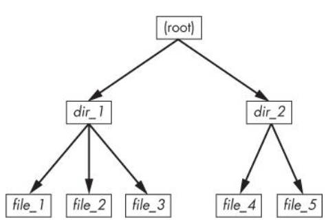
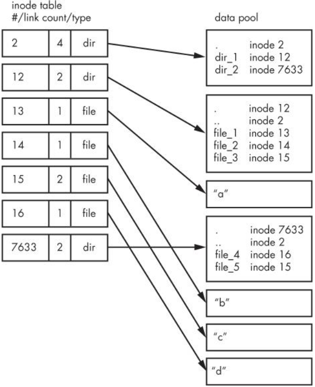

# inodes

A traditional Unix filesystem has two primary components: a pool of data blocks where you can store data
and a database system that manages the data pool. The database is centered around the inode data structure.
An inode is a set of data that describes a particular file, including its type, permissions, and—perhaps most
importantly—where in the data pool the file data resides. Inodes are identified by numbers listed in an inode
table

To play around with this, let's make a hierarchy of files

```bash
$ mkdir dir_1
$ mkdir dir_2
$ echo a > dir_1/file_1
$ echo b > dir_1/file_2
$ echo c > dir_1/file_3
$ echo d > dir_2/file_4
$ ln dir_1/file_3 dir_2/file_5
```
**NOTICE** ln is used without `-s` which means this is a hard link


The above commands would look like this in a reasonable diagram:



But to the kernel, it looks like this:




You can view the inode number of any file

```bash
$ ls -i dir_1 dir_2
dir_1:
45882050 file_1  45882051 file_2  45882053 file_3

dir_2:
45882052 file_4  45882053 file_5
```