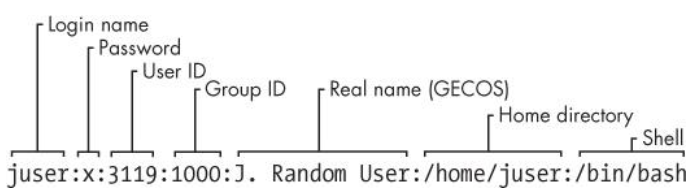

# User Groups

Since you can have multiple users on a single system, the information about each user has to be stored, which exists at `/etc/passwd`

You can view all users with

```bash
cat /etc/passwd
```





Groups in Unix offer a way to share files with certain users but deny access to all others. The idea is that you
can set read or write permission bits for a particular group, excluding everyone else. This feature was once
important because many users shared one machine, but it’s become less significant in recent years as
workstations are shared less often

You can view the groups your user is part of with the command `groups`
```bash
$ groups
mitch adm cdrom sudo dip plugdev lxd
```