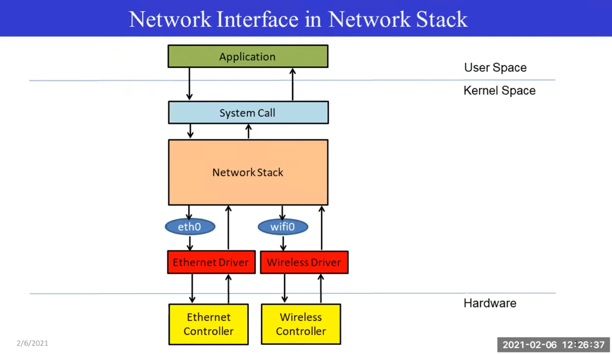

# Device Driver Management

Device drivers are privileged (kernel space) low level hardware hardling routines. Device Drivers are essential to interact with any piece of hardware such as a USB drive, network adapter, CPU, ect...

* Image from LKF